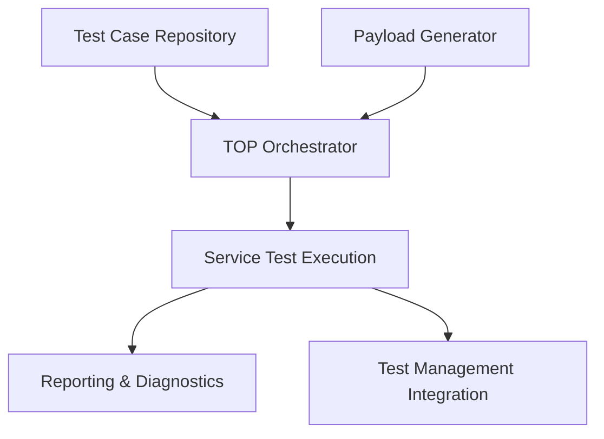
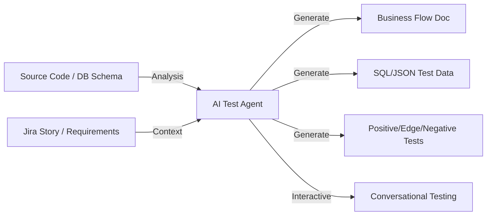

# Walkthrough: Testing Orchestration Platform (TOP) + AI Test Agent POC

This document outlines the architecture, problem statement, current capabilities, limitations, and the AI-driven enhancements for the **Testing Orchestration Platform (TOP)** and its **AI Test Agent** POC.

---

## 1. Problem Statement

Modern enterprise software testing faces three critical bottlenecks that slow down delivery cycles:

1. **High Onboarding Overhead**: When onboarding a new service or API, QA engineers must manually study source code, controllers, DTOs, and validation logic to map the system's business flows. This process can take days or weeks for complex microservices.
2. **Test Data Bottlenecks**: Generating realistic test data requires deep knowledge of database schemas, foreign keys, mandatory fields, and relationship hierarchies. Predefined static datasets quickly become stale.
3. **Manual Scenario Authoring**: Writing edge-case and negative tests is highly subjective and depends on the experience of the individual QA engineer. Critical edge cases are often missed, leading to production defects.
4. **Rigid Test Execution**: Existing platforms require rigid, pre-defined test scripts. QA teams cannot query or test the system dynamically or conversationally.

---

## 2. Testing Orchestration Platform (TOP) — Current Capabilities & Gaps

The base **Testing Orchestration Platform (TOP)** is a robust orchestration layer designed to automate test execution.

### Current Capabilities:
* **Service Test Execution**: Automated triggers for REST and messaging-based test runs.
* **Payload Generation**: Templates for generating request payloads.
* **Reporting**: Aggregating test results and log traces.
* **Test Management**: Synchronization with Jira and CI/CD pipelines.

### Current Gaps:
* **Manual Onboarding**: A human must inspect the microservice codebase and manually define the JSON schemas and endpoints.
* **Static Scenario Generation**: Scenarios must be manually scripted; there is no dynamic adaptation to changes in business rules.
* **Rigid Data Relationships**: Test data is generated based on fixed templates rather than dynamically understanding database constraints.

---

## 3. The AI Test Agent Solution

The **AI Test Agent** integrates LLMs, structured knowledge extraction, and RAG into TOP to automate onboarding, scenario creation, and data generation.

### Core AI Use Cases:

#### Use Case 1: Intelligent Service Onboarding (P1)
* **Goal**: Automate code analysis to map out system behavior.
* **Workflow**: The AI parses the project structure, controller routes, validation annotations (e.g., `@NotNull`, `@Size`), and DTO models.
* **Output**: A comprehensive Business Flow Document detailing service contracts, endpoints, request schemas, validation rules, and dependencies.

#### Use Case 2: Intelligent Test Data Generation (P1)
* **Goal**: Generate synthetically valid datasets.
* **Workflow**: The AI inspects DB schemas (DDL), identifies required entities, foreign key constraints, and enum domains.
* **Output**: Production-like JSON/SQL payloads that respect relational integrity.

#### Use Case 3: AI Scenario Generation (P2)
* **Goal**: Automated test case design based on requirements.
* **Workflow**: The user provides a Jira user story or business description. The AI parses the requirements and generates a test suite.
* **Output**: Categorized test cases covering:
  - **Positive Flows** (Happy path validation)
  - **Negative Flows** (Error handling, validation failures)
  - **Edge Cases** (Boundary values, concurrency scenarios)

#### Use Case 4: Conversational Testing (P3)
* **Goal**: Natural language test management.
* **Workflow**: QA engineers chat directly with the Test Agent.
* **Examples**:
  - *"Generate cancellation scenarios for an unpaid order."*
  - *"Test the Transfer Order workflow with an invalid source warehouse ID."*

---

## 4. Business Value & Impact

* **90% Reduction in Onboarding Time**: New microservices are mapped in minutes instead of days.
* **100% Schema Compliance**: Dynamic test data adheres strictly to database and API schemas.
* **Expanded Test Coverage**: Automatically flags boundary value and security edge cases that manual testers might miss.
* **Domain-Agnostic & Scalable**: Works across retail, finance, logistics, and telecom codebases without domain-specific training.
